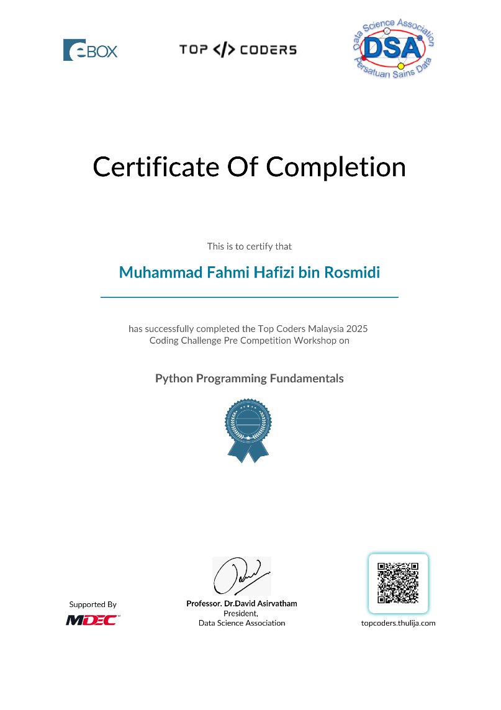

# 📜 Python Programming Fundamental Certificate  

  
  
  

---

## 🎯 Certificate Overview  
🏆 **Certificate Title:** *Python Programming Fundamental*  
📌 **Focus:** Building a strong foundation in Python programming  

### 🔑 Key Topics Covered  
- 🐍 Python syntax and structure  
- 📊 Variables, data types, and operators  
- 🔄 Conditional statements & loops  
- ⚙️ Functions and modular programming  
- 💡 Problem-solving with Python  

---

## 🛠 Skills Acquired  
✔️ Write efficient and structured Python code  
✔️ Understand programming logic and control flow  
✔️ Solve beginner-level computational problems  
✔️ Strong foundation for advanced Python topics like:  
   - 📈 Data Analysis  
   - 🌐 Web Development  
   - 🤖 Automation  

---

## 📂 Repository Content  
📄 `CERT TOPCODERS.pdf` → My official certificate  

---

## 🖼 Certificate Preview  


---
## 💻 Example Python Script  

Here’s a simple script I wrote during my learning:  

```python
# Example: Basic Calculator in Python

def add(x, y):
    return x + y

def subtract(x, y):
    return x - y

def multiply(x, y):
    return x * y

def divide(x, y):
    if y != 0:
        return x / y
    else:
        return "Error! Division by zero."

print("Simple Calculator")
print("Select operation: +, -, *, /")

operation = input("Enter operation: ")
num1 = float(input("Enter first number: "))
num2 = float(input("Enter second number: "))

if operation == '+':
    print("Result:", add(num1, num2))
elif operation == '-':
    print("Result:", subtract(num1, num2))
elif operation == '*':
    print("Result:", multiply(num1, num2))
elif operation == '/':
    print("Result:", divide(num1, num2))
else:
    print("Invalid operation!")
